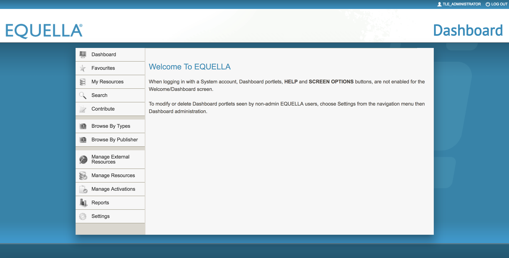
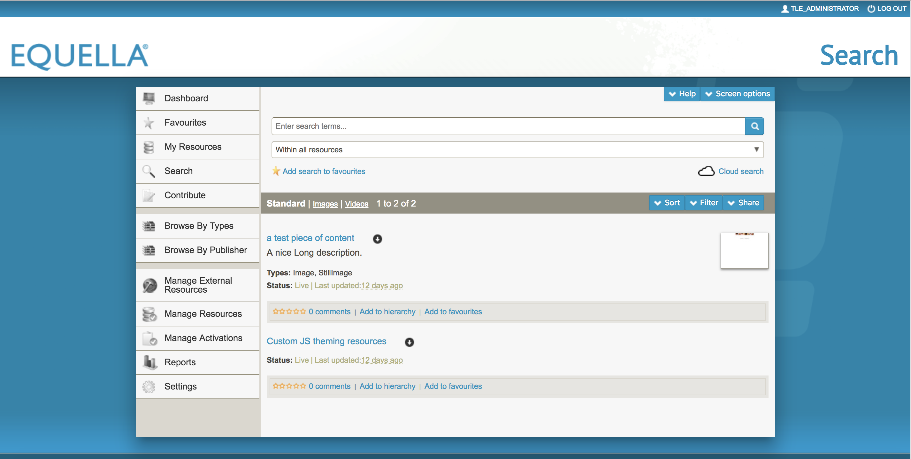
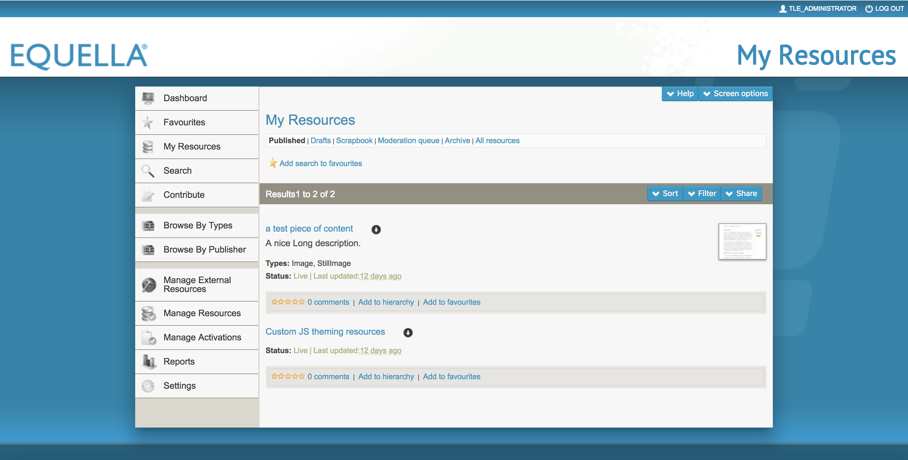
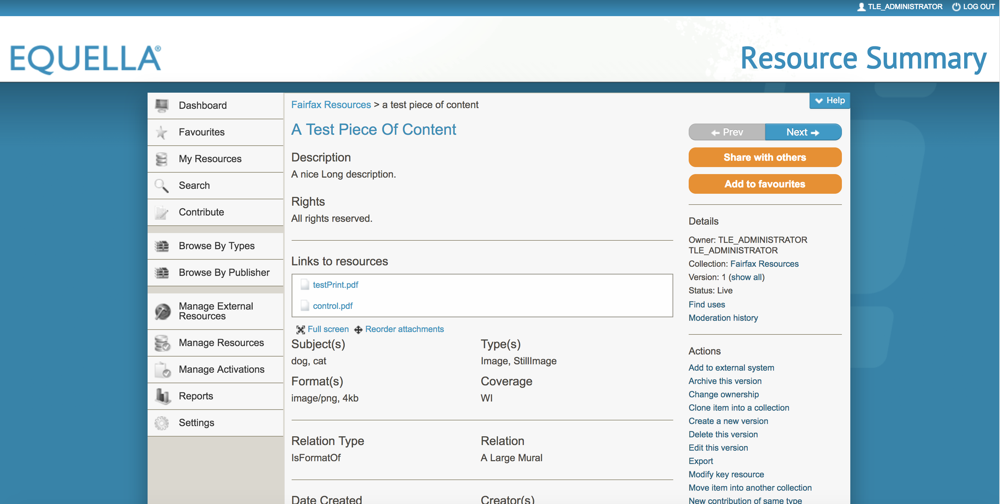
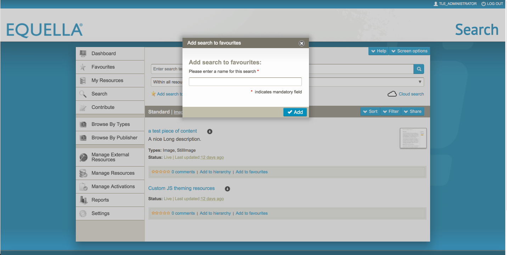
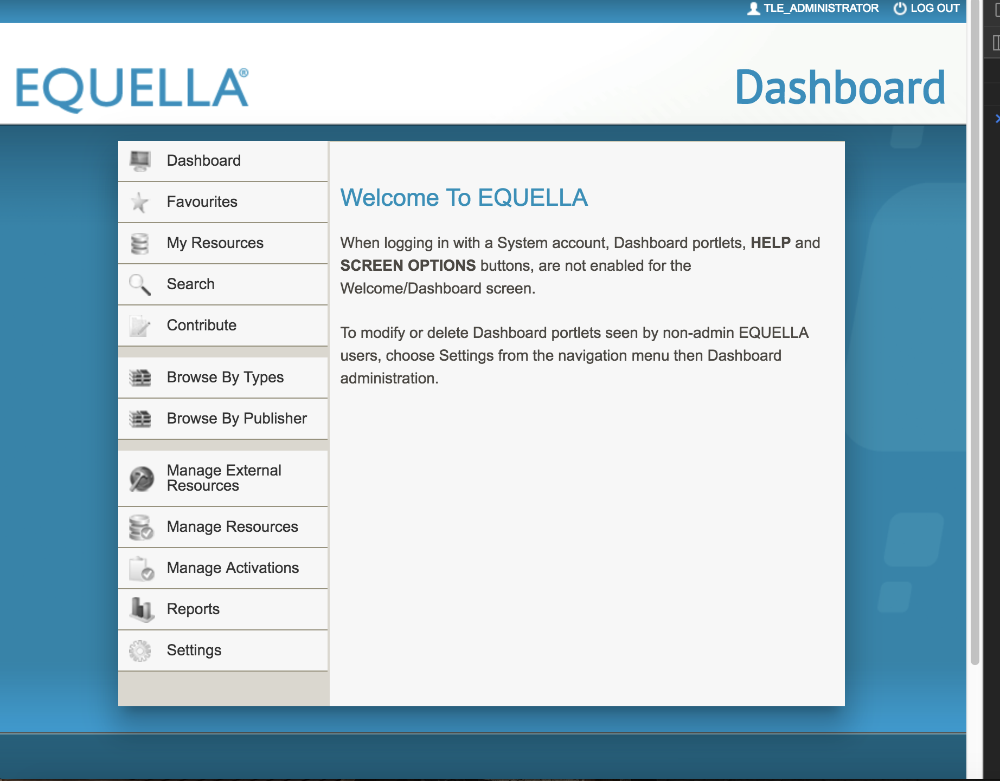

# oeq-theme-old-ui-sass

Repository for theming the 'old UI' of openEQUELLA (6.5).

Uses a Javascript script in the language pack to enhance the stability of the theme.

## Quickstart ##
1. Clone repo, and run `npm install`, and `npm run zip-css`
2. Take the resulting `css.zip` and upload it into your openEQUELLA instance as the theme
3. Update the language pack to reference the `customer.js` file (TODO - explain a bit)
4. Contribute a resource that is viewable by `Everyone` that contains the `customer.js` file 
5. Setup a shortcut URL that references the resource's `customer.js` via `custom-scripts`

Home


Search


My Resources


Resource Summary


Modals


Responsive


## Equella Sass Theme Maker ##

The aim of this project is to make theming Equella more streamlined. This project uses node-sass-chokidar and node-zip.

### Install This Repo: ###
```bash
git clone 
```

To use the Sass builder, change directory into the standard-theme/src folder and:

```bash
npm install
npm run watch-css
```

The standard-theme/src folder provides a structure in which to help theme Equella projects. These files are not exhaustive, but an example to show how to streamline theming.
Directory explanation:

#### src > scss >

* variables - for app-wide Sass variables - like colors
* extends - these are utility classes that can be extended inside other classes
* mixins - for more advance features
* libs - for overrides of third-party libraries
* partials - this folder holds styles broken up according to elements
* sections - these are the main sections of the Equella app, according to the navigation menu

All of the above imported partials feed into the customer.scss file, which in turn is watched and built into the dest > css > customer.css file.

***NOTE*** 
The styles in all of the Sass files are optional only - all contents can be deleted. However it is recommended to keep and add to the existing Sass modular file structure.


#### Usage: ###

**All Commands:**
```bash
npm run watch-css
npm run build-css
npm run clean-css
npm run zip-css
```

**Development:**
This command watches the Sass files and rebuilds them into a compact customer.css file along with sourcemap in the standard-theme/dist/css directory.
```bash
npm run watch-css
```

**Build:**
This command builds a minified version of customer.css and generates a sourcemap, outputting to the standard-theme/dist/css folder.
```bash
npm run build-css
```

**Output Zip File:**
This command creates an updated minifed css build and sourcemap, outputting a css.zip file in the standard-theme/dist/ folder.
```bash
npm run zip-css
```

### Best Practices for Sass Theming ###
1. Use of Sass variables for color theming for project consistency
2. Increased contrast of background vs. color text for readability
3. WCAG suggests used of 14px for minimum font size. Though this would require much more rework, the font sizes have been boosted for readability
4. Override of set pixel widths for containers to allow responsive reflow in use of percentage units
5. Override of float layouts in favor of Flexbox API for document flow to secure predictable DOM layout
6. Use of box-shadows over borders to maintain predictable box-model layout
7. Root-level box-sizing of border box to maintain box-model layout
8. Addition of hover, focus, and active achor, button, and button image classes for keyboard tabbing and accessible
9. CSS class view separation (via jQuery on this project) to add different classes on the body according to window location pathname
10. Use of !important ONLY to override inline styles, otherwise use of cascade targetting or class or id duplication (.container.container.container) to increase specificity in overrides

### custom-resources ###
Inside the custom-resources folder is currently the customer.js file. This file uses jQuery to recognize the route the user is on and alter the class name of the body tag. This body tag class is referenced inside of the Sass theme.

